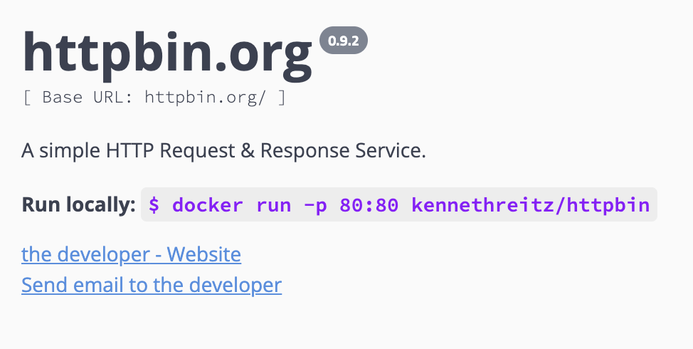

<div align="left">

[](https://httpbin.org)

# Httpbin<a id="httpbin"></a>

A simple HTTP Request & Response Service.<br/> <br/> <b>Run locally: </b> <code>$ docker run -p 80:80 kennethreitz/httpbin</code>


</div>

## Table of Contents<a id="table-of-contents"></a>

<!-- toc -->

- [Requirements](#requirements)
- [Installation](#installation)
- [Getting Started](#getting-started)
- [Async](#async)
- [Raw HTTP Response](#raw-http-response)
- [Reference](#reference)
  * [`httpbin.anything.get_anything`](#httpbinanythingget_anything)
  * [`httpbin.anything.get_data`](#httpbinanythingget_data)
  * [`httpbin.anything.get_data_0`](#httpbinanythingget_data_0)
  * [`httpbin.anything.get_data_1`](#httpbinanythingget_data_1)
  * [`httpbin.anything.get_data_2`](#httpbinanythingget_data_2)
  * [`httpbin.anything.get_passed_data`](#httpbinanythingget_passed_data)
  * [`httpbin.anything.get_passed_data_0`](#httpbinanythingget_passed_data_0)
  * [`httpbin.anything.post_request_data`](#httpbinanythingpost_request_data)
  * [`httpbin.anything.put_request_data`](#httpbinanythingput_request_data)
  * [`httpbin.anything.return_data`](#httpbinanythingreturn_data)
  * [`httpbin.anything.return_request_data`](#httpbinanythingreturn_request_data)
  * [`httpbin.anything.update_anything_data`](#httpbinanythingupdate_anything_data)
  * [`httpbin.auth.digest_auth_prompt`](#httpbinauthdigest_auth_prompt)
  * [`httpbin.auth.prompt_authorization`](#httpbinauthprompt_authorization)
  * [`httpbin.auth.prompt_authorization_using_digest`](#httpbinauthprompt_authorization_using_digest)
  * [`httpbin.auth.prompt_authorization_using_http_get`](#httpbinauthprompt_authorization_using_http_get)
  * [`httpbin.auth.prompt_user_authorization`](#httpbinauthprompt_user_authorization)
  * [`httpbin.auth.user_authorization_digest`](#httpbinauthuser_authorization_digest)
  * [`httpbin.cookies.delete_redirect_to_cookie_list`](#httpbincookiesdelete_redirect_to_cookie_list)
  * [`httpbin.cookies.get_data`](#httpbincookiesget_data)
  * [`httpbin.cookies.set_cookie_redirect`](#httpbincookiesset_cookie_redirect)
  * [`httpbin.cookies.set_redirect`](#httpbincookiesset_redirect)
  * [`httpbin.dynamic_data.decode_base64url_string`](#httpbindynamic_datadecode_base64url_string)
  * [`httpbin.dynamic_data.delayed_response_delete`](#httpbindynamic_datadelayed_response_delete)
  * [`httpbin.dynamic_data.delayed_response_get`](#httpbindynamic_datadelayed_response_get)
  * [`httpbin.dynamic_data.drip_data_over_duration`](#httpbindynamic_datadrip_data_over_duration)
  * [`httpbin.dynamic_data.generate_page_containing_links`](#httpbindynamic_datagenerate_page_containing_links)
  * [`httpbin.dynamic_data.generate_uuid`](#httpbindynamic_datagenerate_uuid)
  * [`httpbin.dynamic_data.get_random_bytes`](#httpbindynamic_dataget_random_bytes)
  * [`httpbin.dynamic_data.return_delayed_response`](#httpbindynamic_datareturn_delayed_response)
  * [`httpbin.dynamic_data.return_delayed_response_0`](#httpbindynamic_datareturn_delayed_response_0)
  * [`httpbin.dynamic_data.return_delayed_response_1`](#httpbindynamic_datareturn_delayed_response_1)
  * [`httpbin.dynamic_data.return_delayed_response_trace`](#httpbindynamic_datareturn_delayed_response_trace)
  * [`httpbin.dynamic_data.stream_json_responses`](#httpbindynamic_datastream_json_responses)
  * [`httpbin.dynamic_data.stream_random_bytes`](#httpbindynamic_datastream_random_bytes)
  * [`httpbin.dynamic_data.stream_random_bytes_0`](#httpbindynamic_datastream_random_bytes_0)
  * [`httpbin.http_methods.delete_request_parameters`](#httpbinhttp_methodsdelete_request_parameters)
  * [`httpbin.http_methods.post_request_parameters`](#httpbinhttp_methodspost_request_parameters)
  * [`httpbin.http_methods.put_request_parameters`](#httpbinhttp_methodsput_request_parameters)
  * [`httpbin.http_methods.request_query_parameters_get`](#httpbinhttp_methodsrequest_query_parameters_get)
  * [`httpbin.http_methods.update_request_parameters`](#httpbinhttp_methodsupdate_request_parameters)
  * [`httpbin.images.get_by_accept_header`](#httpbinimagesget_by_accept_header)
  * [`httpbin.images.get_jpeg_image`](#httpbinimagesget_jpeg_image)
  * [`httpbin.images.get_png_image`](#httpbinimagesget_png_image)
  * [`httpbin.images.get_svg_image`](#httpbinimagesget_svg_image)
  * [`httpbin.images.get_webp_image`](#httpbinimagesget_webp_image)
  * [`httpbin.redirects.absolutely_redirects_n`](#httpbinredirectsabsolutely_redirects_n)
  * [`httpbin.redirects.call_302_redirects_n`](#httpbinredirectscall_302_redirects_n)
  * [`httpbin.redirects.given_url_put_redirect`](#httpbinredirectsgiven_url_put_redirect)
  * [`httpbin.redirects.relatively302_redirects_n`](#httpbinredirectsrelatively302_redirects_n)
  * [`httpbin.redirects.to_given_url_delete`](#httpbinredirectsto_given_url_delete)
  * [`httpbin.redirects.to_given_url_get`](#httpbinredirectsto_given_url_get)
  * [`httpbin.redirects.to_given_url_patch`](#httpbinredirectsto_given_url_patch)
  * [`httpbin.redirects.to_given_url_post`](#httpbinredirectsto_given_url_post)
  * [`httpbin.redirects.to_given_url_trace`](#httpbinredirectsto_given_url_trace)
  * [`httpbin.request_inspection.incoming_headers_get`](#httpbinrequest_inspectionincoming_headers_get)
  * [`httpbin.request_inspection.ip_address_get`](#httpbinrequest_inspectionip_address_get)
  * [`httpbin.request_inspection.user_agent_get`](#httpbinrequest_inspectionuser_agent_get)
  * [`httpbin.response_formats.brotli_get_data`](#httpbinresponse_formatsbrotli_get_data)
  * [`httpbin.response_formats.deflate_data_get`](#httpbinresponse_formatsdeflate_data_get)
  * [`httpbin.response_formats.denied_page_get`](#httpbinresponse_formatsdenied_page_get)
  * [`httpbin.response_formats.get_robots_rules`](#httpbinresponse_formatsget_robots_rules)
  * [`httpbin.response_formats.gzip_data_get`](#httpbinresponse_formatsgzip_data_get)
  * [`httpbin.response_formats.simple_html_get`](#httpbinresponse_formatssimple_html_get)
  * [`httpbin.response_formats.simple_json_get`](#httpbinresponse_formatssimple_json_get)
  * [`httpbin.response_formats.simple_xml_get`](#httpbinresponse_formatssimple_xml_get)
  * [`httpbin.response_formats.utf8_body_get`](#httpbinresponse_formatsutf8_body_get)
  * [`httpbin.response_inspection.cache_control_set`](#httpbinresponse_inspectioncache_control_set)
  * [`httpbin.response_inspection.get_response_headers`](#httpbinresponse_inspectionget_response_headers)
  * [`httpbin.response_inspection.not_modified_get`](#httpbinresponse_inspectionnot_modified_get)
  * [`httpbin.response_inspection.query_headers_get`](#httpbinresponse_inspectionquery_headers_get)
  * [`httpbin.response_inspection.resource_inspection_get`](#httpbinresponse_inspectionresource_inspection_get)
  * [`httpbin.status_codes.return_random_code`](#httpbinstatus_codesreturn_random_code)
  * [`httpbin.status_codes.return_random_code_0`](#httpbinstatus_codesreturn_random_code_0)
  * [`httpbin.status_codes.return_random_code_1`](#httpbinstatus_codesreturn_random_code_1)
  * [`httpbin.status_codes.return_random_code_2`](#httpbinstatus_codesreturn_random_code_2)
  * [`httpbin.status_codes.return_random_code_3`](#httpbinstatus_codesreturn_random_code_3)
  * [`httpbin.status_codes.return_random_code_4`](#httpbinstatus_codesreturn_random_code_4)

<!-- tocstop -->

## Requirements<a id="requirements"></a>

Python >=3.7

## Installation<a id="installation"></a>
<div align="center">
  <a href="https://konfigthis.com/sdk-sign-up?company=httpbin&language=Python">
    
  </a>
</div>

## Getting Started<a id="getting-started"></a>

```python
from pprint import pprint
from httpbin_python_sdk import Httpbin, ApiException

httpbin = Httpbin(
)

try:
    # Returns anything passed in request data.
    httpbin.anything.get_anything()
except ApiException as e:
    print("Exception when calling AnythingApi.get_anything: %s\n" % e)
    pprint(e.body)
    pprint(e.headers)
    pprint(e.status)
    pprint(e.reason)
    pprint(e.round_trip_time)
```

## Async<a id="async"></a>

`async` support is available by prepending `a` to any method.

```python

import asyncio
from pprint import pprint
from httpbin_python_sdk import Httpbin, ApiException

httpbin = Httpbin(
)

async def main():
    try:
        # Returns anything passed in request data.
        await httpbin.anything.aget_anything()
    except ApiException as e:
        print("Exception when calling AnythingApi.get_anything: %s\n" % e)
        pprint(e.body)
        pprint(e.headers)
        pprint(e.status)
        pprint(e.reason)
        pprint(e.round_trip_time)

asyncio.run(main())
```

## Raw HTTP Response<a id="raw-http-response"></a>

To access raw HTTP response values, use the `.raw` namespace.

```python
from pprint import pprint
from httpbin_python_sdk import Httpbin, ApiException

httpbin = Httpbin(
)

try:
    # Returns anything passed in request data.
    get_anything_response = httpbin.anything.raw.get_anything()
    pprint(get_anything_response.headers)
    pprint(get_anything_response.status)
    pprint(get_anything_response.round_trip_time)
except ApiException as e:
    print("Exception when calling AnythingApi.get_anything: %s\n" % e)
    pprint(e.body)
    pprint(e.headers)
    pprint(e.status)
    pprint(e.reason)
    pprint(e.round_trip_time)
```


## Reference<a id="reference"></a>
### `httpbin.anything.get_anything`<a id="httpbinanythingget_anything"></a>

Returns anything passed in request data.

#### 🛠️ Usage<a id="🛠️-usage"></a>

```python
httpbin.anything.get_anything()
```

#### 🌐 Endpoint<a id="🌐-endpoint"></a>

`/anything/{anything}` `delete`

[🔙 **Back to Table of Contents**](#table-of-contents)

---

### `httpbin.anything.get_data`<a id="httpbinanythingget_data"></a>

Returns anything passed in request data.

#### 🛠️ Usage<a id="🛠️-usage"></a>

```python
httpbin.anything.get_data()
```

#### 🌐 Endpoint<a id="🌐-endpoint"></a>

`/anything` `get`

[🔙 **Back to Table of Contents**](#table-of-contents)

---

### `httpbin.anything.get_data_0`<a id="httpbinanythingget_data_0"></a>

Returns anything passed in request data.

#### 🛠️ Usage<a id="🛠️-usage"></a>

```python
httpbin.anything.get_data_0()
```

#### 🌐 Endpoint<a id="🌐-endpoint"></a>

`/anything` `delete`

[🔙 **Back to Table of Contents**](#table-of-contents)

---

### `httpbin.anything.get_data_1`<a id="httpbinanythingget_data_1"></a>

Returns anything passed in request data.

#### 🛠️ Usage<a id="🛠️-usage"></a>

```python
httpbin.anything.get_data_1()
```

#### 🌐 Endpoint<a id="🌐-endpoint"></a>

`/anything` `patch`

[🔙 **Back to Table of Contents**](#table-of-contents)

---

### `httpbin.anything.get_data_2`<a id="httpbinanythingget_data_2"></a>

Returns anything passed in request data.

#### 🛠️ Usage<a id="🛠️-usage"></a>

```python
httpbin.anything.get_data_2()
```

#### 🌐 Endpoint<a id="🌐-endpoint"></a>

`/anything/{anything}` `get`

[🔙 **Back to Table of Contents**](#table-of-contents)

---

### `httpbin.anything.get_passed_data`<a id="httpbinanythingget_passed_data"></a>

Returns anything passed in request data.

#### 🛠️ Usage<a id="🛠️-usage"></a>

```python
httpbin.anything.get_passed_data()
```

#### 🌐 Endpoint<a id="🌐-endpoint"></a>

`/anything` `trace`

[🔙 **Back to Table of Contents**](#table-of-contents)

---

### `httpbin.anything.get_passed_data_0`<a id="httpbinanythingget_passed_data_0"></a>

Returns anything passed in request data.

#### 🛠️ Usage<a id="🛠️-usage"></a>

```python
httpbin.anything.get_passed_data_0()
```

#### 🌐 Endpoint<a id="🌐-endpoint"></a>

`/anything/{anything}` `trace`

[🔙 **Back to Table of Contents**](#table-of-contents)

---

### `httpbin.anything.post_request_data`<a id="httpbinanythingpost_request_data"></a>

Returns anything passed in request data.

#### 🛠️ Usage<a id="🛠️-usage"></a>

```python
httpbin.anything.post_request_data()
```

#### 🌐 Endpoint<a id="🌐-endpoint"></a>

`/anything` `post`

[🔙 **Back to Table of Contents**](#table-of-contents)

---

### `httpbin.anything.put_request_data`<a id="httpbinanythingput_request_data"></a>

Returns anything passed in request data.

#### 🛠️ Usage<a id="🛠️-usage"></a>

```python
httpbin.anything.put_request_data()
```

#### 🌐 Endpoint<a id="🌐-endpoint"></a>

`/anything` `put`

[🔙 **Back to Table of Contents**](#table-of-contents)

---

### `httpbin.anything.return_data`<a id="httpbinanythingreturn_data"></a>

Returns anything passed in request data.

#### 🛠️ Usage<a id="🛠️-usage"></a>

```python
httpbin.anything.return_data()
```

#### 🌐 Endpoint<a id="🌐-endpoint"></a>

`/anything/{anything}` `put`

[🔙 **Back to Table of Contents**](#table-of-contents)

---

### `httpbin.anything.return_request_data`<a id="httpbinanythingreturn_request_data"></a>

Returns anything passed in request data.

#### 🛠️ Usage<a id="🛠️-usage"></a>

```python
httpbin.anything.return_request_data()
```

#### 🌐 Endpoint<a id="🌐-endpoint"></a>

`/anything/{anything}` `post`

[🔙 **Back to Table of Contents**](#table-of-contents)

---

### `httpbin.anything.update_anything_data`<a id="httpbinanythingupdate_anything_data"></a>

Returns anything passed in request data.

#### 🛠️ Usage<a id="🛠️-usage"></a>

```python
httpbin.anything.update_anything_data()
```

#### 🌐 Endpoint<a id="🌐-endpoint"></a>

`/anything/{anything}` `patch`

[🔙 **Back to Table of Contents**](#table-of-contents)

---

### `httpbin.auth.digest_auth_prompt`<a id="httpbinauthdigest_auth_prompt"></a>

Prompts the user for authorization using Digest Auth.

#### 🛠️ Usage<a id="🛠️-usage"></a>

```python
httpbin.auth.digest_auth_prompt(
    qop="qop_example",
    user="user_example",
    passwd="passwd_example",
)
```

#### ⚙️ Parameters<a id="⚙️-parameters"></a>

##### qop: `str`<a id="qop-str"></a>

auth or auth-int

##### user: `str`<a id="user-str"></a>

##### passwd: `str`<a id="passwd-str"></a>

#### 🌐 Endpoint<a id="🌐-endpoint"></a>

`/digest-auth/{qop}/{user}/{passwd}` `get`

[🔙 **Back to Table of Contents**](#table-of-contents)

---

### `httpbin.auth.prompt_authorization`<a id="httpbinauthprompt_authorization"></a>

Prompts the user for authorization using bearer authentication.

#### 🛠️ Usage<a id="🛠️-usage"></a>

```python
httpbin.auth.prompt_authorization(
    authorization="string_example",
)
```

#### ⚙️ Parameters<a id="⚙️-parameters"></a>

##### authorization: `str`<a id="authorization-str"></a>

#### 🌐 Endpoint<a id="🌐-endpoint"></a>

`/bearer` `get`

[🔙 **Back to Table of Contents**](#table-of-contents)

---

### `httpbin.auth.prompt_authorization_using_digest`<a id="httpbinauthprompt_authorization_using_digest"></a>

allow settings the stale_after argument.


#### 🛠️ Usage<a id="🛠️-usage"></a>

```python
httpbin.auth.prompt_authorization_using_digest(
    qop="qop_example",
    user="user_example",
    passwd="passwd_example",
    algorithm="MD5",
    stale_after="never",
)
```

#### ⚙️ Parameters<a id="⚙️-parameters"></a>

##### qop: `str`<a id="qop-str"></a>

auth or auth-int

##### user: `str`<a id="user-str"></a>

##### passwd: `str`<a id="passwd-str"></a>

##### algorithm: `str`<a id="algorithm-str"></a>

MD5, SHA-256, SHA-512

##### stale_after: `str`<a id="stale_after-str"></a>

#### 🌐 Endpoint<a id="🌐-endpoint"></a>

`/digest-auth/{qop}/{user}/{passwd}/{algorithm}/{stale_after}` `get`

[🔙 **Back to Table of Contents**](#table-of-contents)

---

### `httpbin.auth.prompt_authorization_using_http_get`<a id="httpbinauthprompt_authorization_using_http_get"></a>

Prompts the user for authorization using HTTP Basic Auth.

#### 🛠️ Usage<a id="🛠️-usage"></a>

```python
httpbin.auth.prompt_authorization_using_http_get(
    user="user_example",
    passwd="passwd_example",
)
```

#### ⚙️ Parameters<a id="⚙️-parameters"></a>

##### user: `str`<a id="user-str"></a>

##### passwd: `str`<a id="passwd-str"></a>

#### 🌐 Endpoint<a id="🌐-endpoint"></a>

`/basic-auth/{user}/{passwd}` `get`

[🔙 **Back to Table of Contents**](#table-of-contents)

---

### `httpbin.auth.prompt_user_authorization`<a id="httpbinauthprompt_user_authorization"></a>

Prompts the user for authorization using HTTP Basic Auth.

#### 🛠️ Usage<a id="🛠️-usage"></a>

```python
httpbin.auth.prompt_user_authorization(
    user="user_example",
    passwd="passwd_example",
)
```

#### ⚙️ Parameters<a id="⚙️-parameters"></a>

##### user: `str`<a id="user-str"></a>

##### passwd: `str`<a id="passwd-str"></a>

#### 🌐 Endpoint<a id="🌐-endpoint"></a>

`/hidden-basic-auth/{user}/{passwd}` `get`

[🔙 **Back to Table of Contents**](#table-of-contents)

---

### `httpbin.auth.user_authorization_digest`<a id="httpbinauthuser_authorization_digest"></a>

Prompts the user for authorization using Digest Auth + Algorithm.

#### 🛠️ Usage<a id="🛠️-usage"></a>

```python
httpbin.auth.user_authorization_digest(
    qop="qop_example",
    user="user_example",
    passwd="passwd_example",
    algorithm="MD5",
)
```

#### ⚙️ Parameters<a id="⚙️-parameters"></a>

##### qop: `str`<a id="qop-str"></a>

auth or auth-int

##### user: `str`<a id="user-str"></a>

##### passwd: `str`<a id="passwd-str"></a>

##### algorithm: `str`<a id="algorithm-str"></a>

MD5, SHA-256, SHA-512

#### 🌐 Endpoint<a id="🌐-endpoint"></a>

`/digest-auth/{qop}/{user}/{passwd}/{algorithm}` `get`

[🔙 **Back to Table of Contents**](#table-of-contents)

---

### `httpbin.cookies.delete_redirect_to_cookie_list`<a id="httpbincookiesdelete_redirect_to_cookie_list"></a>

Deletes cookie(s) as provided by the query string and redirects to cookie list.

#### 🛠️ Usage<a id="🛠️-usage"></a>

```python
httpbin.cookies.delete_redirect_to_cookie_list(
    freeform={
        "key": "string_example",
    },
)
```

#### ⚙️ Parameters<a id="⚙️-parameters"></a>

##### freeform: [`Dict[str, str]`](./httpbin_python_sdk/type/.py)<a id="freeform-dictstr-strhttpbin_python_sdktypepy"></a>

#### 🌐 Endpoint<a id="🌐-endpoint"></a>

`/cookies/delete` `get`

[🔙 **Back to Table of Contents**](#table-of-contents)

---

### `httpbin.cookies.get_data`<a id="httpbincookiesget_data"></a>

Returns cookie data.

#### 🛠️ Usage<a id="🛠️-usage"></a>

```python
httpbin.cookies.get_data()
```

#### 🌐 Endpoint<a id="🌐-endpoint"></a>

`/cookies` `get`

[🔙 **Back to Table of Contents**](#table-of-contents)

---

### `httpbin.cookies.set_cookie_redirect`<a id="httpbincookiesset_cookie_redirect"></a>

Sets a cookie and redirects to cookie list.

#### 🛠️ Usage<a id="🛠️-usage"></a>

```python
httpbin.cookies.set_cookie_redirect(
    name="name_example",
    value="value_example",
)
```

#### ⚙️ Parameters<a id="⚙️-parameters"></a>

##### name: `str`<a id="name-str"></a>

##### value: `str`<a id="value-str"></a>

#### 🌐 Endpoint<a id="🌐-endpoint"></a>

`/cookies/set/{name}/{value}` `get`

[🔙 **Back to Table of Contents**](#table-of-contents)

---

### `httpbin.cookies.set_redirect`<a id="httpbincookiesset_redirect"></a>

Sets cookie(s) as provided by the query string and redirects to cookie list.

#### 🛠️ Usage<a id="🛠️-usage"></a>

```python
httpbin.cookies.set_redirect(
    freeform={
        "key": "string_example",
    },
)
```

#### ⚙️ Parameters<a id="⚙️-parameters"></a>

##### freeform: [`Dict[str, str]`](./httpbin_python_sdk/type/.py)<a id="freeform-dictstr-strhttpbin_python_sdktypepy"></a>

#### 🌐 Endpoint<a id="🌐-endpoint"></a>

`/cookies/set` `get`

[🔙 **Back to Table of Contents**](#table-of-contents)

---

### `httpbin.dynamic_data.decode_base64url_string`<a id="httpbindynamic_datadecode_base64url_string"></a>

Decodes base64url-encoded string.

#### 🛠️ Usage<a id="🛠️-usage"></a>

```python
httpbin.dynamic_data.decode_base64url_string(
    value="SFRUUEJJTiBpcyBhd2Vzb21l",
)
```

#### ⚙️ Parameters<a id="⚙️-parameters"></a>

##### value: `str`<a id="value-str"></a>

#### 🌐 Endpoint<a id="🌐-endpoint"></a>

`/base64/{value}` `get`

[🔙 **Back to Table of Contents**](#table-of-contents)

---

### `httpbin.dynamic_data.delayed_response_delete`<a id="httpbindynamic_datadelayed_response_delete"></a>

Returns a delayed response (max of 10 seconds).

#### 🛠️ Usage<a id="🛠️-usage"></a>

```python
httpbin.dynamic_data.delayed_response_delete(
    delay=,
)
```

#### ⚙️ Parameters<a id="⚙️-parameters"></a>

##### delay: [`ModelInt`](./httpbin_python_sdk/type/.py)<a id="delay-modelinthttpbin_python_sdktypepy"></a>

#### 🌐 Endpoint<a id="🌐-endpoint"></a>

`/delay/{delay}` `delete`

[🔙 **Back to Table of Contents**](#table-of-contents)

---

### `httpbin.dynamic_data.delayed_response_get`<a id="httpbindynamic_datadelayed_response_get"></a>

Returns a delayed response (max of 10 seconds).

#### 🛠️ Usage<a id="🛠️-usage"></a>

```python
httpbin.dynamic_data.delayed_response_get(
    delay=,
)
```

#### ⚙️ Parameters<a id="⚙️-parameters"></a>

##### delay: [`ModelInt`](./httpbin_python_sdk/type/.py)<a id="delay-modelinthttpbin_python_sdktypepy"></a>

#### 🌐 Endpoint<a id="🌐-endpoint"></a>

`/delay/{delay}` `get`

[🔙 **Back to Table of Contents**](#table-of-contents)

---

### `httpbin.dynamic_data.drip_data_over_duration`<a id="httpbindynamic_datadrip_data_over_duration"></a>

Drips data over a duration after an optional initial delay.

#### 🛠️ Usage<a id="🛠️-usage"></a>

```python
httpbin.dynamic_data.drip_data_over_duration(
    duration=2,
    numbytes=10,
    code=200,
    delay=2,
)
```

#### ⚙️ Parameters<a id="⚙️-parameters"></a>

##### duration: `Union[int, float]`<a id="duration-unionint-float"></a>

The amount of time (in seconds) over which to drip each byte

##### numbytes: `int`<a id="numbytes-int"></a>

The number of bytes to respond with

##### code: `int`<a id="code-int"></a>

The response code that will be returned

##### delay: `Union[int, float]`<a id="delay-unionint-float"></a>

The amount of time (in seconds) to delay before responding

#### 🌐 Endpoint<a id="🌐-endpoint"></a>

`/drip` `get`

[🔙 **Back to Table of Contents**](#table-of-contents)

---

### `httpbin.dynamic_data.generate_page_containing_links`<a id="httpbindynamic_datagenerate_page_containing_links"></a>

Generate a page containing n links to other pages which do the same.

#### 🛠️ Usage<a id="🛠️-usage"></a>

```python
httpbin.dynamic_data.generate_page_containing_links(
    n=,
    offset=,
)
```

#### ⚙️ Parameters<a id="⚙️-parameters"></a>

##### n: [`ModelInt`](./httpbin_python_sdk/type/.py)<a id="n-modelinthttpbin_python_sdktypepy"></a>

##### offset: [`ModelInt`](./httpbin_python_sdk/type/.py)<a id="offset-modelinthttpbin_python_sdktypepy"></a>

#### 🌐 Endpoint<a id="🌐-endpoint"></a>

`/links/{n}/{offset}` `get`

[🔙 **Back to Table of Contents**](#table-of-contents)

---

### `httpbin.dynamic_data.generate_uuid`<a id="httpbindynamic_datagenerate_uuid"></a>

Return a UUID4.

#### 🛠️ Usage<a id="🛠️-usage"></a>

```python
httpbin.dynamic_data.generate_uuid()
```

#### 🌐 Endpoint<a id="🌐-endpoint"></a>

`/uuid` `get`

[🔙 **Back to Table of Contents**](#table-of-contents)

---

### `httpbin.dynamic_data.get_random_bytes`<a id="httpbindynamic_dataget_random_bytes"></a>

Returns n random bytes generated with given seed

#### 🛠️ Usage<a id="🛠️-usage"></a>

```python
httpbin.dynamic_data.get_random_bytes(
    n=,
)
```

#### ⚙️ Parameters<a id="⚙️-parameters"></a>

##### n: [`ModelInt`](./httpbin_python_sdk/type/.py)<a id="n-modelinthttpbin_python_sdktypepy"></a>

#### 🌐 Endpoint<a id="🌐-endpoint"></a>

`/bytes/{n}` `get`

[🔙 **Back to Table of Contents**](#table-of-contents)

---

### `httpbin.dynamic_data.return_delayed_response`<a id="httpbindynamic_datareturn_delayed_response"></a>

Returns a delayed response (max of 10 seconds).

#### 🛠️ Usage<a id="🛠️-usage"></a>

```python
httpbin.dynamic_data.return_delayed_response(
    delay=,
)
```

#### ⚙️ Parameters<a id="⚙️-parameters"></a>

##### delay: [`ModelInt`](./httpbin_python_sdk/type/.py)<a id="delay-modelinthttpbin_python_sdktypepy"></a>

#### 🌐 Endpoint<a id="🌐-endpoint"></a>

`/delay/{delay}` `put`

[🔙 **Back to Table of Contents**](#table-of-contents)

---

### `httpbin.dynamic_data.return_delayed_response_0`<a id="httpbindynamic_datareturn_delayed_response_0"></a>

Returns a delayed response (max of 10 seconds).

#### 🛠️ Usage<a id="🛠️-usage"></a>

```python
httpbin.dynamic_data.return_delayed_response_0(
    delay=,
)
```

#### ⚙️ Parameters<a id="⚙️-parameters"></a>

##### delay: [`ModelInt`](./httpbin_python_sdk/type/.py)<a id="delay-modelinthttpbin_python_sdktypepy"></a>

#### 🌐 Endpoint<a id="🌐-endpoint"></a>

`/delay/{delay}` `post`

[🔙 **Back to Table of Contents**](#table-of-contents)

---

### `httpbin.dynamic_data.return_delayed_response_1`<a id="httpbindynamic_datareturn_delayed_response_1"></a>

Returns a delayed response (max of 10 seconds).

#### 🛠️ Usage<a id="🛠️-usage"></a>

```python
httpbin.dynamic_data.return_delayed_response_1(
    delay=,
)
```

#### ⚙️ Parameters<a id="⚙️-parameters"></a>

##### delay: [`ModelInt`](./httpbin_python_sdk/type/.py)<a id="delay-modelinthttpbin_python_sdktypepy"></a>

#### 🌐 Endpoint<a id="🌐-endpoint"></a>

`/delay/{delay}` `patch`

[🔙 **Back to Table of Contents**](#table-of-contents)

---

### `httpbin.dynamic_data.return_delayed_response_trace`<a id="httpbindynamic_datareturn_delayed_response_trace"></a>

Returns a delayed response (max of 10 seconds).

#### 🛠️ Usage<a id="🛠️-usage"></a>

```python
httpbin.dynamic_data.return_delayed_response_trace(
    delay=,
)
```

#### ⚙️ Parameters<a id="⚙️-parameters"></a>

##### delay: [`ModelInt`](./httpbin_python_sdk/type/.py)<a id="delay-modelinthttpbin_python_sdktypepy"></a>

#### 🌐 Endpoint<a id="🌐-endpoint"></a>

`/delay/{delay}` `trace`

[🔙 **Back to Table of Contents**](#table-of-contents)

---

### `httpbin.dynamic_data.stream_json_responses`<a id="httpbindynamic_datastream_json_responses"></a>

Stream n JSON responses

#### 🛠️ Usage<a id="🛠️-usage"></a>

```python
httpbin.dynamic_data.stream_json_responses(
    n=,
)
```

#### ⚙️ Parameters<a id="⚙️-parameters"></a>

##### n: [`ModelInt`](./httpbin_python_sdk/type/.py)<a id="n-modelinthttpbin_python_sdktypepy"></a>

#### 🌐 Endpoint<a id="🌐-endpoint"></a>

`/stream/{n}` `get`

[🔙 **Back to Table of Contents**](#table-of-contents)

---

### `httpbin.dynamic_data.stream_random_bytes`<a id="httpbindynamic_datastream_random_bytes"></a>

Streams n random bytes generated with given seed, at given chunk size per packet.

#### 🛠️ Usage<a id="🛠️-usage"></a>

```python
httpbin.dynamic_data.stream_random_bytes(
    numbytes=,
)
```

#### ⚙️ Parameters<a id="⚙️-parameters"></a>

##### numbytes: [`ModelInt`](./httpbin_python_sdk/type/.py)<a id="numbytes-modelinthttpbin_python_sdktypepy"></a>

#### 🌐 Endpoint<a id="🌐-endpoint"></a>

`/range/{numbytes}` `get`

[🔙 **Back to Table of Contents**](#table-of-contents)

---

### `httpbin.dynamic_data.stream_random_bytes_0`<a id="httpbindynamic_datastream_random_bytes_0"></a>

Streams n random bytes generated with given seed, at given chunk size per packet.

#### 🛠️ Usage<a id="🛠️-usage"></a>

```python
httpbin.dynamic_data.stream_random_bytes_0(
    n=,
)
```

#### ⚙️ Parameters<a id="⚙️-parameters"></a>

##### n: [`ModelInt`](./httpbin_python_sdk/type/.py)<a id="n-modelinthttpbin_python_sdktypepy"></a>

#### 🌐 Endpoint<a id="🌐-endpoint"></a>

`/stream-bytes/{n}` `get`

[🔙 **Back to Table of Contents**](#table-of-contents)

---

### `httpbin.http_methods.delete_request_parameters`<a id="httpbinhttp_methodsdelete_request_parameters"></a>

The request's DELETE parameters.

#### 🛠️ Usage<a id="🛠️-usage"></a>

```python
httpbin.http_methods.delete_request_parameters()
```

#### 🌐 Endpoint<a id="🌐-endpoint"></a>

`/delete` `delete`

[🔙 **Back to Table of Contents**](#table-of-contents)

---

### `httpbin.http_methods.post_request_parameters`<a id="httpbinhttp_methodspost_request_parameters"></a>

The request's POST parameters.

#### 🛠️ Usage<a id="🛠️-usage"></a>

```python
httpbin.http_methods.post_request_parameters()
```

#### 🌐 Endpoint<a id="🌐-endpoint"></a>

`/post` `post`

[🔙 **Back to Table of Contents**](#table-of-contents)

---

### `httpbin.http_methods.put_request_parameters`<a id="httpbinhttp_methodsput_request_parameters"></a>

The request's PUT parameters.

#### 🛠️ Usage<a id="🛠️-usage"></a>

```python
httpbin.http_methods.put_request_parameters()
```

#### 🌐 Endpoint<a id="🌐-endpoint"></a>

`/put` `put`

[🔙 **Back to Table of Contents**](#table-of-contents)

---

### `httpbin.http_methods.request_query_parameters_get`<a id="httpbinhttp_methodsrequest_query_parameters_get"></a>

The request's query parameters.

#### 🛠️ Usage<a id="🛠️-usage"></a>

```python
httpbin.http_methods.request_query_parameters_get()
```

#### 🌐 Endpoint<a id="🌐-endpoint"></a>

`/get` `get`

[🔙 **Back to Table of Contents**](#table-of-contents)

---

### `httpbin.http_methods.update_request_parameters`<a id="httpbinhttp_methodsupdate_request_parameters"></a>

The request's PATCH parameters.

#### 🛠️ Usage<a id="🛠️-usage"></a>

```python
httpbin.http_methods.update_request_parameters()
```

#### 🌐 Endpoint<a id="🌐-endpoint"></a>

`/patch` `patch`

[🔙 **Back to Table of Contents**](#table-of-contents)

---

### `httpbin.images.get_by_accept_header`<a id="httpbinimagesget_by_accept_header"></a>

Returns a simple image of the type suggest by the Accept header.

#### 🛠️ Usage<a id="🛠️-usage"></a>

```python
httpbin.images.get_by_accept_header()
```

#### 🌐 Endpoint<a id="🌐-endpoint"></a>

`/image` `get`

[🔙 **Back to Table of Contents**](#table-of-contents)

---

### `httpbin.images.get_jpeg_image`<a id="httpbinimagesget_jpeg_image"></a>

Returns a simple JPEG image.

#### 🛠️ Usage<a id="🛠️-usage"></a>

```python
httpbin.images.get_jpeg_image()
```

#### 🌐 Endpoint<a id="🌐-endpoint"></a>

`/image/jpeg` `get`

[🔙 **Back to Table of Contents**](#table-of-contents)

---

### `httpbin.images.get_png_image`<a id="httpbinimagesget_png_image"></a>

Returns a simple PNG image.

#### 🛠️ Usage<a id="🛠️-usage"></a>

```python
httpbin.images.get_png_image()
```

#### 🌐 Endpoint<a id="🌐-endpoint"></a>

`/image/png` `get`

[🔙 **Back to Table of Contents**](#table-of-contents)

---

### `httpbin.images.get_svg_image`<a id="httpbinimagesget_svg_image"></a>

Returns a simple SVG image.

#### 🛠️ Usage<a id="🛠️-usage"></a>

```python
httpbin.images.get_svg_image()
```

#### 🌐 Endpoint<a id="🌐-endpoint"></a>

`/image/svg` `get`

[🔙 **Back to Table of Contents**](#table-of-contents)

---

### `httpbin.images.get_webp_image`<a id="httpbinimagesget_webp_image"></a>

Returns a simple WEBP image.

#### 🛠️ Usage<a id="🛠️-usage"></a>

```python
httpbin.images.get_webp_image()
```

#### 🌐 Endpoint<a id="🌐-endpoint"></a>

`/image/webp` `get`

[🔙 **Back to Table of Contents**](#table-of-contents)

---

### `httpbin.redirects.absolutely_redirects_n`<a id="httpbinredirectsabsolutely_redirects_n"></a>

Absolutely 302 Redirects n times.

#### 🛠️ Usage<a id="🛠️-usage"></a>

```python
httpbin.redirects.absolutely_redirects_n(
    n=,
)
```

#### ⚙️ Parameters<a id="⚙️-parameters"></a>

##### n: [`ModelInt`](./httpbin_python_sdk/type/.py)<a id="n-modelinthttpbin_python_sdktypepy"></a>

#### 🌐 Endpoint<a id="🌐-endpoint"></a>

`/absolute-redirect/{n}` `get`

[🔙 **Back to Table of Contents**](#table-of-contents)

---

### `httpbin.redirects.call_302_redirects_n`<a id="httpbinredirectscall_302_redirects_n"></a>

302 Redirects n times.

#### 🛠️ Usage<a id="🛠️-usage"></a>

```python
httpbin.redirects.call_302_redirects_n(
    n=,
)
```

#### ⚙️ Parameters<a id="⚙️-parameters"></a>

##### n: [`ModelInt`](./httpbin_python_sdk/type/.py)<a id="n-modelinthttpbin_python_sdktypepy"></a>

#### 🌐 Endpoint<a id="🌐-endpoint"></a>

`/redirect/{n}` `get`

[🔙 **Back to Table of Contents**](#table-of-contents)

---

### `httpbin.redirects.given_url_put_redirect`<a id="httpbinredirectsgiven_url_put_redirect"></a>

302/3XX Redirects to the given URL.

#### 🛠️ Usage<a id="🛠️-usage"></a>

```python
httpbin.redirects.given_url_put_redirect(
    url="string_example",
    status_code=,
)
```

#### ⚙️ Parameters<a id="⚙️-parameters"></a>

##### url: `str`<a id="url-str"></a>

##### status_code: [`ModelInt`](./httpbin_python_sdk/type/model_int.py)<a id="status_code-modelinthttpbin_python_sdktypemodel_intpy"></a>

#### ⚙️ Request Body<a id="⚙️-request-body"></a>

[`RedirectsToGivenUrlPostRequest`](./httpbin_python_sdk/type/redirects_to_given_url_post_request.py)
#### 🌐 Endpoint<a id="🌐-endpoint"></a>

`/redirect-to` `put`

[🔙 **Back to Table of Contents**](#table-of-contents)

---

### `httpbin.redirects.relatively302_redirects_n`<a id="httpbinredirectsrelatively302_redirects_n"></a>

Relatively 302 Redirects n times.

#### 🛠️ Usage<a id="🛠️-usage"></a>

```python
httpbin.redirects.relatively302_redirects_n(
    n=,
)
```

#### ⚙️ Parameters<a id="⚙️-parameters"></a>

##### n: [`ModelInt`](./httpbin_python_sdk/type/.py)<a id="n-modelinthttpbin_python_sdktypepy"></a>

#### 🌐 Endpoint<a id="🌐-endpoint"></a>

`/relative-redirect/{n}` `get`

[🔙 **Back to Table of Contents**](#table-of-contents)

---

### `httpbin.redirects.to_given_url_delete`<a id="httpbinredirectsto_given_url_delete"></a>

302/3XX Redirects to the given URL.

#### 🛠️ Usage<a id="🛠️-usage"></a>

```python
httpbin.redirects.to_given_url_delete()
```

#### 🌐 Endpoint<a id="🌐-endpoint"></a>

`/redirect-to` `delete`

[🔙 **Back to Table of Contents**](#table-of-contents)

---

### `httpbin.redirects.to_given_url_get`<a id="httpbinredirectsto_given_url_get"></a>

302/3XX Redirects to the given URL.

#### 🛠️ Usage<a id="🛠️-usage"></a>

```python
httpbin.redirects.to_given_url_get(
    url="url_example",
    status_code=,
)
```

#### ⚙️ Parameters<a id="⚙️-parameters"></a>

##### url: `str`<a id="url-str"></a>

##### status_code: [`ModelInt`](./httpbin_python_sdk/type/.py)<a id="status_code-modelinthttpbin_python_sdktypepy"></a>

#### 🌐 Endpoint<a id="🌐-endpoint"></a>

`/redirect-to` `get`

[🔙 **Back to Table of Contents**](#table-of-contents)

---

### `httpbin.redirects.to_given_url_patch`<a id="httpbinredirectsto_given_url_patch"></a>

302/3XX Redirects to the given URL.

#### 🛠️ Usage<a id="🛠️-usage"></a>

```python
httpbin.redirects.to_given_url_patch()
```

#### 🌐 Endpoint<a id="🌐-endpoint"></a>

`/redirect-to` `patch`

[🔙 **Back to Table of Contents**](#table-of-contents)

---

### `httpbin.redirects.to_given_url_post`<a id="httpbinredirectsto_given_url_post"></a>

302/3XX Redirects to the given URL.

#### 🛠️ Usage<a id="🛠️-usage"></a>

```python
httpbin.redirects.to_given_url_post(
    url="string_example",
    status_code=,
)
```

#### ⚙️ Parameters<a id="⚙️-parameters"></a>

##### url: `str`<a id="url-str"></a>

##### status_code: [`ModelInt`](./httpbin_python_sdk/type/model_int.py)<a id="status_code-modelinthttpbin_python_sdktypemodel_intpy"></a>

#### ⚙️ Request Body<a id="⚙️-request-body"></a>

[`RedirectsToGivenUrlPostRequest`](./httpbin_python_sdk/type/redirects_to_given_url_post_request.py)
#### 🌐 Endpoint<a id="🌐-endpoint"></a>

`/redirect-to` `post`

[🔙 **Back to Table of Contents**](#table-of-contents)

---

### `httpbin.redirects.to_given_url_trace`<a id="httpbinredirectsto_given_url_trace"></a>

302/3XX Redirects to the given URL.

#### 🛠️ Usage<a id="🛠️-usage"></a>

```python
httpbin.redirects.to_given_url_trace()
```

#### 🌐 Endpoint<a id="🌐-endpoint"></a>

`/redirect-to` `trace`

[🔙 **Back to Table of Contents**](#table-of-contents)

---

### `httpbin.request_inspection.incoming_headers_get`<a id="httpbinrequest_inspectionincoming_headers_get"></a>

Return the incoming request's HTTP headers.

#### 🛠️ Usage<a id="🛠️-usage"></a>

```python
httpbin.request_inspection.incoming_headers_get()
```

#### 🌐 Endpoint<a id="🌐-endpoint"></a>

`/headers` `get`

[🔙 **Back to Table of Contents**](#table-of-contents)

---

### `httpbin.request_inspection.ip_address_get`<a id="httpbinrequest_inspectionip_address_get"></a>

Returns the requester's IP Address.

#### 🛠️ Usage<a id="🛠️-usage"></a>

```python
httpbin.request_inspection.ip_address_get()
```

#### 🌐 Endpoint<a id="🌐-endpoint"></a>

`/ip` `get`

[🔙 **Back to Table of Contents**](#table-of-contents)

---

### `httpbin.request_inspection.user_agent_get`<a id="httpbinrequest_inspectionuser_agent_get"></a>

Return the incoming requests's User-Agent header.

#### 🛠️ Usage<a id="🛠️-usage"></a>

```python
httpbin.request_inspection.user_agent_get()
```

#### 🌐 Endpoint<a id="🌐-endpoint"></a>

`/user-agent` `get`

[🔙 **Back to Table of Contents**](#table-of-contents)

---

### `httpbin.response_formats.brotli_get_data`<a id="httpbinresponse_formatsbrotli_get_data"></a>

Returns Brotli-encoded data.

#### 🛠️ Usage<a id="🛠️-usage"></a>

```python
httpbin.response_formats.brotli_get_data()
```

#### 🌐 Endpoint<a id="🌐-endpoint"></a>

`/brotli` `get`

[🔙 **Back to Table of Contents**](#table-of-contents)

---

### `httpbin.response_formats.deflate_data_get`<a id="httpbinresponse_formatsdeflate_data_get"></a>

Returns Deflate-encoded data.

#### 🛠️ Usage<a id="🛠️-usage"></a>

```python
httpbin.response_formats.deflate_data_get()
```

#### 🌐 Endpoint<a id="🌐-endpoint"></a>

`/deflate` `get`

[🔙 **Back to Table of Contents**](#table-of-contents)

---

### `httpbin.response_formats.denied_page_get`<a id="httpbinresponse_formatsdenied_page_get"></a>

Returns page denied by robots.txt rules.

#### 🛠️ Usage<a id="🛠️-usage"></a>

```python
httpbin.response_formats.denied_page_get()
```

#### 🌐 Endpoint<a id="🌐-endpoint"></a>

`/deny` `get`

[🔙 **Back to Table of Contents**](#table-of-contents)

---

### `httpbin.response_formats.get_robots_rules`<a id="httpbinresponse_formatsget_robots_rules"></a>

Returns some robots.txt rules.

#### 🛠️ Usage<a id="🛠️-usage"></a>

```python
httpbin.response_formats.get_robots_rules()
```

#### 🌐 Endpoint<a id="🌐-endpoint"></a>

`/robots.txt` `get`

[🔙 **Back to Table of Contents**](#table-of-contents)

---

### `httpbin.response_formats.gzip_data_get`<a id="httpbinresponse_formatsgzip_data_get"></a>

Returns GZip-encoded data.

#### 🛠️ Usage<a id="🛠️-usage"></a>

```python
httpbin.response_formats.gzip_data_get()
```

#### 🌐 Endpoint<a id="🌐-endpoint"></a>

`/gzip` `get`

[🔙 **Back to Table of Contents**](#table-of-contents)

---

### `httpbin.response_formats.simple_html_get`<a id="httpbinresponse_formatssimple_html_get"></a>

Returns a simple HTML document.

#### 🛠️ Usage<a id="🛠️-usage"></a>

```python
httpbin.response_formats.simple_html_get()
```

#### 🌐 Endpoint<a id="🌐-endpoint"></a>

`/html` `get`

[🔙 **Back to Table of Contents**](#table-of-contents)

---

### `httpbin.response_formats.simple_json_get`<a id="httpbinresponse_formatssimple_json_get"></a>

Returns a simple JSON document.

#### 🛠️ Usage<a id="🛠️-usage"></a>

```python
httpbin.response_formats.simple_json_get()
```

#### 🌐 Endpoint<a id="🌐-endpoint"></a>

`/json` `get`

[🔙 **Back to Table of Contents**](#table-of-contents)

---

### `httpbin.response_formats.simple_xml_get`<a id="httpbinresponse_formatssimple_xml_get"></a>

Returns a simple XML document.

#### 🛠️ Usage<a id="🛠️-usage"></a>

```python
httpbin.response_formats.simple_xml_get()
```

#### 🌐 Endpoint<a id="🌐-endpoint"></a>

`/xml` `get`

[🔙 **Back to Table of Contents**](#table-of-contents)

---

### `httpbin.response_formats.utf8_body_get`<a id="httpbinresponse_formatsutf8_body_get"></a>

Returns a UTF-8 encoded body.

#### 🛠️ Usage<a id="🛠️-usage"></a>

```python
httpbin.response_formats.utf8_body_get()
```

#### 🌐 Endpoint<a id="🌐-endpoint"></a>

`/encoding/utf8` `get`

[🔙 **Back to Table of Contents**](#table-of-contents)

---

### `httpbin.response_inspection.cache_control_set`<a id="httpbinresponse_inspectioncache_control_set"></a>

Sets a Cache-Control header for n seconds.

#### 🛠️ Usage<a id="🛠️-usage"></a>

```python
httpbin.response_inspection.cache_control_set(
    value=1,
)
```

#### ⚙️ Parameters<a id="⚙️-parameters"></a>

##### value: `int`<a id="value-int"></a>

#### 🌐 Endpoint<a id="🌐-endpoint"></a>

`/cache/{value}` `get`

[🔙 **Back to Table of Contents**](#table-of-contents)

---

### `httpbin.response_inspection.get_response_headers`<a id="httpbinresponse_inspectionget_response_headers"></a>

Returns a set of response headers from the query string.

#### 🛠️ Usage<a id="🛠️-usage"></a>

```python
httpbin.response_inspection.get_response_headers(
    freeform={
        "key": "string_example",
    },
)
```

#### ⚙️ Parameters<a id="⚙️-parameters"></a>

##### freeform: [`Dict[str, str]`](./httpbin_python_sdk/type/.py)<a id="freeform-dictstr-strhttpbin_python_sdktypepy"></a>

#### 🌐 Endpoint<a id="🌐-endpoint"></a>

`/response-headers` `post`

[🔙 **Back to Table of Contents**](#table-of-contents)

---

### `httpbin.response_inspection.not_modified_get`<a id="httpbinresponse_inspectionnot_modified_get"></a>

Returns a 304 if an If-Modified-Since header or If-None-Match is present. Returns the same as a GET otherwise.

#### 🛠️ Usage<a id="🛠️-usage"></a>

```python
httpbin.response_inspection.not_modified_get(
    if_modified_since="string_example",
    if_none_match="string_example",
)
```

#### ⚙️ Parameters<a id="⚙️-parameters"></a>

##### if_modified_since: `str`<a id="if_modified_since-str"></a>

##### if_none_match: `str`<a id="if_none_match-str"></a>

#### 🌐 Endpoint<a id="🌐-endpoint"></a>

`/cache` `get`

[🔙 **Back to Table of Contents**](#table-of-contents)

---

### `httpbin.response_inspection.query_headers_get`<a id="httpbinresponse_inspectionquery_headers_get"></a>

Returns a set of response headers from the query string.

#### 🛠️ Usage<a id="🛠️-usage"></a>

```python
httpbin.response_inspection.query_headers_get(
    freeform={
        "key": "string_example",
    },
)
```

#### ⚙️ Parameters<a id="⚙️-parameters"></a>

##### freeform: [`Dict[str, str]`](./httpbin_python_sdk/type/.py)<a id="freeform-dictstr-strhttpbin_python_sdktypepy"></a>

#### 🌐 Endpoint<a id="🌐-endpoint"></a>

`/response-headers` `get`

[🔙 **Back to Table of Contents**](#table-of-contents)

---

### `httpbin.response_inspection.resource_inspection_get`<a id="httpbinresponse_inspectionresource_inspection_get"></a>

Assumes the resource has the given etag and responds to If-None-Match and If-Match headers appropriately.

#### 🛠️ Usage<a id="🛠️-usage"></a>

```python
httpbin.response_inspection.resource_inspection_get(
    if_none_match="string_example",
    if_match="string_example",
)
```

#### ⚙️ Parameters<a id="⚙️-parameters"></a>

##### if_none_match: `str`<a id="if_none_match-str"></a>

##### if_match: `str`<a id="if_match-str"></a>

#### 🌐 Endpoint<a id="🌐-endpoint"></a>

`/etag/{etag}` `get`

[🔙 **Back to Table of Contents**](#table-of-contents)

---

### `httpbin.status_codes.return_random_code`<a id="httpbinstatus_codesreturn_random_code"></a>

Return status code or random status code if more than one are given

#### 🛠️ Usage<a id="🛠️-usage"></a>

```python
httpbin.status_codes.return_random_code(
    codes="codes_example",
)
```

#### ⚙️ Parameters<a id="⚙️-parameters"></a>

##### codes: `str`<a id="codes-str"></a>

#### 🌐 Endpoint<a id="🌐-endpoint"></a>

`/status/{codes}` `get`

[🔙 **Back to Table of Contents**](#table-of-contents)

---

### `httpbin.status_codes.return_random_code_0`<a id="httpbinstatus_codesreturn_random_code_0"></a>

Return status code or random status code if more than one are given

#### 🛠️ Usage<a id="🛠️-usage"></a>

```python
httpbin.status_codes.return_random_code_0(
    codes="codes_example",
)
```

#### ⚙️ Parameters<a id="⚙️-parameters"></a>

##### codes: `str`<a id="codes-str"></a>

#### 🌐 Endpoint<a id="🌐-endpoint"></a>

`/status/{codes}` `put`

[🔙 **Back to Table of Contents**](#table-of-contents)

---

### `httpbin.status_codes.return_random_code_1`<a id="httpbinstatus_codesreturn_random_code_1"></a>

Return status code or random status code if more than one are given

#### 🛠️ Usage<a id="🛠️-usage"></a>

```python
httpbin.status_codes.return_random_code_1(
    codes="codes_example",
)
```

#### ⚙️ Parameters<a id="⚙️-parameters"></a>

##### codes: `str`<a id="codes-str"></a>

#### 🌐 Endpoint<a id="🌐-endpoint"></a>

`/status/{codes}` `post`

[🔙 **Back to Table of Contents**](#table-of-contents)

---

### `httpbin.status_codes.return_random_code_2`<a id="httpbinstatus_codesreturn_random_code_2"></a>

Return status code or random status code if more than one are given

#### 🛠️ Usage<a id="🛠️-usage"></a>

```python
httpbin.status_codes.return_random_code_2(
    codes="codes_example",
)
```

#### ⚙️ Parameters<a id="⚙️-parameters"></a>

##### codes: `str`<a id="codes-str"></a>

#### 🌐 Endpoint<a id="🌐-endpoint"></a>

`/status/{codes}` `delete`

[🔙 **Back to Table of Contents**](#table-of-contents)

---

### `httpbin.status_codes.return_random_code_3`<a id="httpbinstatus_codesreturn_random_code_3"></a>

Return status code or random status code if more than one are given

#### 🛠️ Usage<a id="🛠️-usage"></a>

```python
httpbin.status_codes.return_random_code_3(
    codes="codes_example",
)
```

#### ⚙️ Parameters<a id="⚙️-parameters"></a>

##### codes: `str`<a id="codes-str"></a>

#### 🌐 Endpoint<a id="🌐-endpoint"></a>

`/status/{codes}` `patch`

[🔙 **Back to Table of Contents**](#table-of-contents)

---

### `httpbin.status_codes.return_random_code_4`<a id="httpbinstatus_codesreturn_random_code_4"></a>

Return status code or random status code if more than one are given

#### 🛠️ Usage<a id="🛠️-usage"></a>

```python
httpbin.status_codes.return_random_code_4(
    codes="codes_example",
)
```

#### ⚙️ Parameters<a id="⚙️-parameters"></a>

##### codes: `str`<a id="codes-str"></a>

#### 🌐 Endpoint<a id="🌐-endpoint"></a>

`/status/{codes}` `trace`

[🔙 **Back to Table of Contents**](#table-of-contents)

---


## Author<a id="author"></a>
This Python package is automatically generated by [Konfig](https://konfigthis.com)
